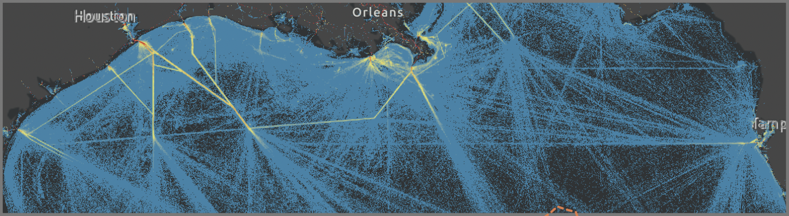
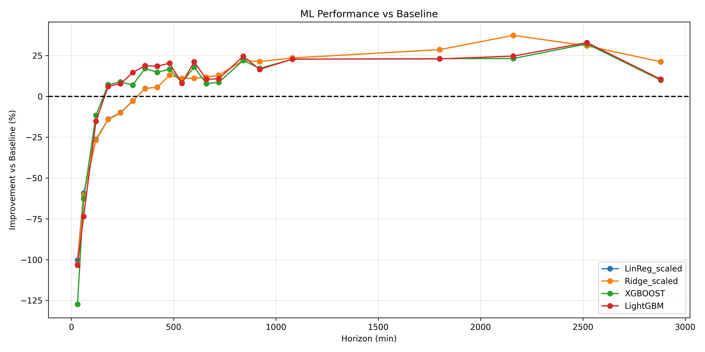
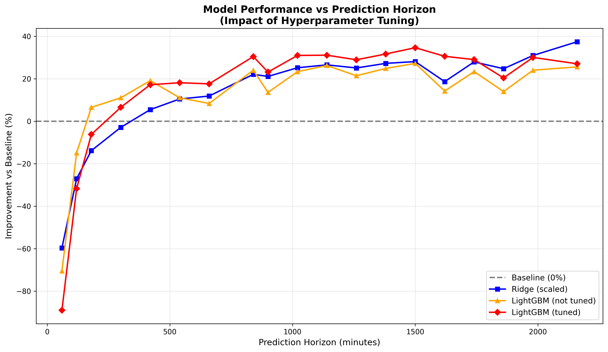

# Shanty Project: Maritime Vessel Position Prediction
## Project Summary Document

---

## 1. Introduction

### Context and Objective

This project aims to predict the future position of maritime vessels using AIS (Automatic Identification System) tracking data. I developed this project to determine when and how machine learning models provide added value compared to simple linear extrapolation for different prediction horizons.

**Operational Context**: Accurate vessel position prediction is crucial for:
- Maritime traffic management and collision prevention
- Port operations optimization (arrival planning, resource allocation)
- Search and rescue operations
- Route planning and fuel consumption estimation

**Study Area**: Gulf of Mexico, December 2024

*Geographic area selected for analysis: Gulf of Mexico*

### Dataset

- **Source**: AIS vessel tracking data (Gulf of Mexico, December 2024)
- **Vessel Types**: Cargo and Tanker vessels
- **Time Period**: 5 days of continuous tracking
- **Volume**: ~1 million position reports from ~1000 vessels
- **Sampling**: Resampled to uniform 5-minute intervals

---

## 2. Executive Summary

### Data Used

I analyzed AIS tracking data from ~1000 cargo and tanker vessels in the Gulf of Mexico (5 days, ~1 million position reports). The data includes vessel position, speed, heading, and physical characteristics (length, width, draft).

### Key Findings

**When ML becomes valuable**: Machine learning models outperform simple linear extrapolation starting at **3-4 hours** of prediction horizon. For shorter horizons, simple extrapolation is sufficient.

**Real-world improvements**:
- **14-hour predictions**: Error reduced from **43.3 km to 30.1 km** (13.2 km improvement, **30.5% reduction**)
- **21-hour predictions**: Error reduced from **62.9 km to 44.7 km** (18.2 km improvement, **28.9% reduction**)

**Search area reduction**: For search and rescue operations, a 13-18 km error reduction translates to a **~40-50% reduction in searchable area** (assuming circular search zones).

**Best model**: LightGBM (optimized) provides the most consistent improvements for horizons beyond 4 hours.

---

## 3. Work Summary and Results

### 3.1 What I Tested

**Models**: I compared several machine learning algorithms (Linear Regression, Ridge, Lasso, Random Forest, XGBoost, LightGBM) against a simple baseline that extrapolates vessel position assuming constant speed and heading.

**Features**: I used historical position, speed, and heading data at different time windows, plus vessel physical characteristics. I tested advanced features (rolling statistics, geometric ratios) but found they didn't improve results.

**Optimization**: I optimized model parameters and removed 3 low-importance features, resulting in modest improvements (2-5%).

### 3.2 Results by Prediction Horizon

**Short-term (< 3 hours)**: Simple linear extrapolation works best. ML models don't help here.

**Medium-term (3-7 hours)**: ML models start to match then exceed baseline around 3-4 hours.

**Long-term (7+ hours)**: ML models provide significant improvements:
- **7 hours**: 3.1 km improvement (19% better)
- **14 hours**: 13.2 km improvement (30.5% better)
- **21 hours**: 18.2 km improvement (28.9% better)
- **31 hours**: 17.2 km improvement (20.4% better)

*Comparison of ML model performance vs baseline. Positive values indicate ML models are better. The "tipping point" around 3-4 hours is clearly visible.*

*Model performance vs prediction horizon showing baseline, Ridge, LightGBM (not tuned), and LightGBM (tuned). The graph illustrates the impact of hyperparameter tuning and the "tipping point" where ML models become valuable. (Note: Generate this image by running notebook 6)*

### 3.3 Detailed Performance Comparison

| Horizon | Baseline Error | LightGBM (optimized) Error | Improvement |
|---------|----------------|----------------------------|-------------|
| 1h | 1.75 km | 3.31 km | -89% (worse) |
| 3h | 7.01 km | 7.44 km | -6% (worse) |
| 7h | 18.55 km | 15.36 km | +17% |
| 14h | 43.25 km | 30.08 km | +30% |
| 21h | 62.86 km | 44.67 km | +29% |
| 31h | 84.15 km | 66.97 km | +20% |

### 3.4 Operational Impact

**Error Reduction**:
- **14-hour predictions**: 13.2 km improvement (30.5% reduction)
- **21-hour predictions**: 18.2 km improvement (28.9% reduction)

**Search Area Reduction**: For search and rescue operations, reducing error by 13-18 km means:
- **14-hour horizon**: Search area reduced from ~5,900 km² to ~2,800 km² (**~53% reduction**)
- **21-hour horizon**: Search area reduced from ~12,400 km² to ~6,300 km² (**~49% reduction**)

---

## 4. Challenges, Limitations, and Future Directions

### Challenges and Limitations

- **Short-term predictions**: ML models don't help for horizons < 3 hours. Simple extrapolation is sufficient.
- **Feature engineering**: Advanced features (rolling statistics, geometric ratios) didn't improve results. The base feature set is already optimal.
- **Limited optimization gains**: Hyperparameter tuning provided modest improvements (2-5%), suggesting default parameters were already close to optimal.
- **Trajectory complexity**: Results are based on open-ocean trajectories. Near ports and harbors, trajectory complexity increases significantly.
- **Horizon-specific tuning**: Model tuning was done at a single horizon (8 hours). Optimal parameters may vary by prediction horizon.

### Future Work

- Integrate weather data and traffic density for context-aware predictions
- Test sequence models (LSTM/RNN) for highly non-linear trajectories
- Optimize parameters for each prediction horizon individually

---

## 5. Technical Appendix

**Code Structure**: I structured the code modularly with separate modules for data preprocessing, feature engineering, model evaluation, and metrics.

**Baseline Model**: I implemented linear extrapolation using current position, speed, and heading, assuming constant motion.

**Data Processing**: I cleaned the data, resampled to 5-minute intervals, and imputed missing values.

**Models Tested**: I evaluated Linear Regression, Ridge, Lasso, Random Forest, XGBoost, and LightGBM. I excluded Lasso and Random Forest due to poor performance (Lasso: 70-100 km errors) and instability (Random Forest: high variance across random states).

**Evaluation**: I used train/test split by vessel to ensure generalization and avoid vessel data leakage. I performed cross-validation with vessel groups. Metric: Haversine distance MAE in kilometers.

**Stability Testing**: I validated results across multiple random seeds to ensure robustness. I tested key horizons with different random states, confirming stable performance patterns.

**Reproducibility**: I fixed random seeds throughout for consistent results.

---

## Conclusion

I found that machine learning models provide meaningful operational value for vessel position prediction at horizons beyond 3-4 hours. My optimized LightGBM model reduces prediction error by **13-18 km** (20-30% improvement) at 14-21 hour horizons, translating to **~50% reduction in searchable area** for search and rescue operations. For shorter horizons, simple linear extrapolation remains the best approach.
