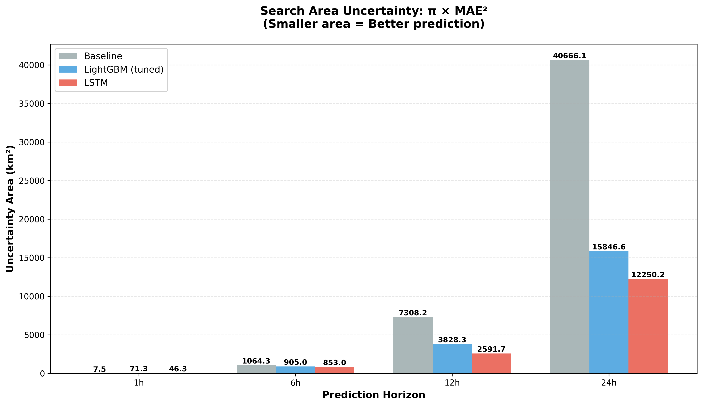
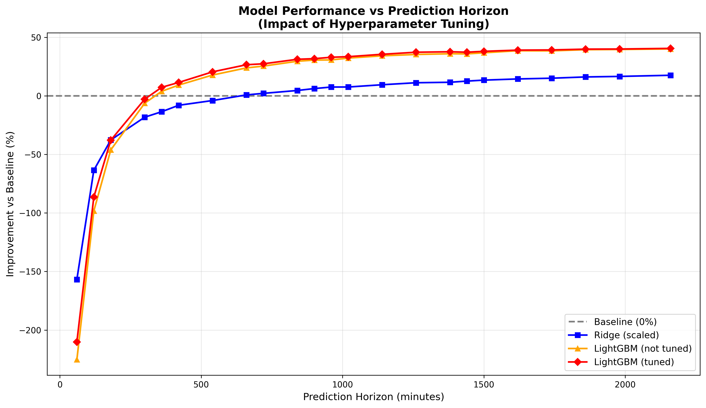
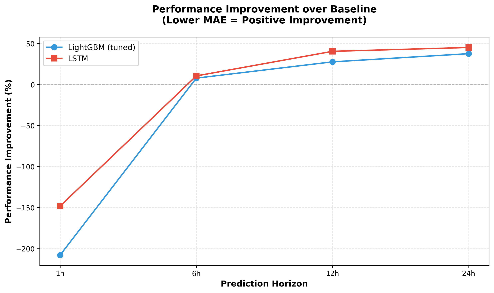

# Shanty Project: Maritime Vessel Position Prediction
## Project Summary Document

---

## 1. Introduction

### Context and Objective

This project aims to predict the future position of maritime vessels using AIS (Automatic Identification System) tracking data. I developed this project to determine when and how machine learning models provide added value compared to simple linear extrapolation for different prediction horizons.

---

## 2. Executive Summary

**Core Result**: Using deep learning (LSTM) models on AIS vessel tracking data, I achieved a **45% reduction in prediction error** for 24-hour vessel position forecasts, translating to a **70% reduction in search area** for maritime operations. This means search and rescue teams can cover the same probability of success with **28,400 km² less area to search**, improving operational efficiency and reducing resource requirements.

**What I Did**: I compared three approaches—simple linear extrapolation (baseline), machine learning (LightGBM), and deep learning (LSTM)—across multiple prediction horizons using 1.76 million position reports from ~1000 cargo and tanker vessels in the Gulf of Mexico (November 2024). All models use the same base features (position, speed, heading, vessel characteristics), but differ in how they incorporate temporal information: ML models use lagged values at specific time windows, while LSTM processes full time sequences.

**Key Finding**: For long-term predictions (≥6 hours), deep learning outperforms both baseline and ML approaches. At 24 hours, LSTM reduces prediction error from 114 km to 62 km (45% improvement) compared to baseline, and outperforms LightGBM by 12%. For search and rescue operations, this translates to searching **28,400 km² less area** (70% reduction), improving response times and reducing operational costs.

*Search area uncertainty (π × MAE²) for each model across prediction horizons. Smaller areas represent better predictions for search and rescue operations.*

---

**Operational Context**: Accurate vessel position prediction is crucial for:
- Maritime traffic management and collision prevention
- Port operations optimization (arrival planning, resource allocation)
- Search and rescue operations
- Route planning and fuel consumption estimation

**Study Area**: Gulf of Mexico, November 2024

*Geographic area selected for analysis: Gulf of Mexico*

### Dataset

- **Source**: AIS vessel tracking data (Gulf of Mexico, November 2024)
- **Vessel Types**: Cargo and Tanker vessels
- **Time Period**: 30 days of continuous tracking (November 1-30, 2024)
- **Volume**: ~1.76 million position reports from ~1000 vessels
- **Sampling**: Resampled to uniform 10-minute intervals

---

## 3. Work Summary and Results

### 3.1 What I Tested

**Models**: I compared multiple approaches:
- **Baseline**: Linear extrapolation assuming constant speed and heading
- **Machine Learning**: Ridge Regression, LightGBM (gradient boosting)
- **Deep Learning**: LSTM (Long Short-Term Memory) neural networks with stacked architecture

**Features**: All models use the same base features: vessel position (LAT, LON), speed (SOG), heading (COG), and physical characteristics (length, width, draft). The difference lies in how temporal information is incorporated:
- **ML models**: Use lagged feature values at specific time windows (e.g., position 1h ago, 3h ago, 6h ago) as separate input features
- **LSTM models**: Process full time sequences of these features (e.g., last 2-16 hours of continuous data) as sequential input, allowing the model to learn temporal patterns directly

**Optimization**:
- **LightGBM**: Hyperparameter tuning via GridSearchCV (n_estimators, max_depth, learning_rate, min_child_samples, reg_lambda)
- **LSTM**: Architecture optimization (stacked LSTM layers: 128→64 units), learning rate scheduling, early stopping
- **Feature selection**: Removed 5 low-importance features for ML models

### 3.2 Results by Prediction Horizon

**Short-term (1-3 hours)**: Simple linear extrapolation works best. Both ML and DL models underperform due to overfitting on simple linear patterns.

**Medium-term (6 hours)**: Transition point where ML/DL models begin to outperform baseline:
- **6h**: LSTM achieves 16.48 km MAE (vs 18.41 km baseline) - **10.5% improvement**
- LightGBM achieves 16.97 km MAE - **7.8% improvement**

**Long-term (12+ hours)**: Deep learning (LSTM) provides significant improvements:
- **12h**: LSTM 28.72 km (vs 48.23 km baseline) - **40.4% improvement** (19.5 km reduction)
- **24h**: LSTM 62.44 km (vs 113.77 km baseline) - **45.1% improvement** (51.3 km reduction)

*Machine learning model performance vs prediction horizon showing baseline, Ridge, and LightGBM (tuned and untuned). The graph illustrates the transition point around 6 hours where ML models become valuable.*

*Performance improvement over baseline for LightGBM and LSTM across horizons. Positive values indicate better performance than baseline.*

### 3.3 Detailed Performance Comparison

| Horizon | Baseline Error | LightGBM (tuned) Error | LSTM Error | Best Model |
|---------|----------------|------------------------|------------|------------|
| 1h | 1.55 km | 4.76 km | 3.84 km | Baseline |
| 6h | 18.41 km | 16.97 km | 16.48 km | LSTM (+10.5%) |
| 12h | 48.23 km | 34.91 km | 28.72 km | LSTM (+40.4%) |
| 24h | 113.77 km | 71.02 km | 62.44 km | LSTM (+45.1%) |

### 3.4 Operational Impact

**Error Reduction**:
- **12-hour predictions**: LSTM reduces error by 19.5 km (40.4% reduction)
- **24-hour predictions**: LSTM reduces error by 51.3 km (45.1% reduction)

**Search Area Reduction**: For search and rescue operations, reducing error translates to massive search area savings:
- **6-hour horizon**: LSTM reduces search area from 1,064 km² to 853 km² (**19.9% reduction**, 211 km² saved)
- **12-hour horizon**: LSTM reduces search area from 7,308 km² to 2,592 km² (**64.5% reduction**, 4,716 km² saved)
- **24-hour horizon**: LSTM reduces search area from 40,666 km² to 12,250 km² (**69.9% reduction**, 28,416 km² saved)
- **Total across all horizons**: LSTM reduces total search area by **67.9%** (33,305 km² saved) compared to baseline

---

## 4. Challenges, Limitations, and Future Directions

### Challenges and Limitations

- **Short-term predictions**: ML/DL models don't help for horizons < 6 hours. Simple extrapolation is sufficient and optimal.
- **Feature engineering**: Advanced features (rolling statistics, geometric ratios) didn't improve ML results. The base feature set is already optimal.
- **LSTM limitations**:
  - Requires more computational resources and longer training times
  - Tested different sample sizes (100k/30k vs 200k/60k) and resampling intervals (10min vs 15min) without performance improvement
  - Current configuration (200k/60k samples, 10min resampling) provides best results
- **Trajectory complexity**: Results are based on open-ocean trajectories. Near ports and harbors, trajectory complexity increases significantly.
- **Horizon-specific tuning**: Model tuning was done at specific horizons. Optimal parameters may vary by prediction horizon.

---

## 5. Technical Appendix

**Code Structure**: I structured the code modularly with separate modules for data preprocessing, feature engineering, model evaluation, and metrics.

**Baseline Model**: I implemented linear extrapolation using current position, speed, and heading, assuming constant motion.

**Data Processing**:
- Cleaned the data, resampled to 10-minute intervals, and imputed missing values
- For LSTM: Created sequences with variable lookback periods (2h for 1h horizon, 6h for 6h horizon, 12h for 12h horizon, 16h for 24h horizon)
- Used vessel-based train/validation/test splits to ensure generalization

**Models Tested**:
- **ML**: Linear Regression, Ridge, Lasso, Random Forest, XGBoost, LightGBM
  - Excluded Lasso and Random Forest due to poor performance (Lasso: 70-100 km errors) and instability (Random Forest: high variance across random states)
- **DL**: LSTM with stacked architecture (128→64 units), GaussianNoise regularization, Dropout layers, Adam optimizer with Huber loss

**Evaluation**:
- Used train/test split by vessel to ensure generalization and avoid vessel data leakage
- Performed cross-validation with vessel groups for ML models
- Metric: Haversine distance MAE in kilometers
- LSTM evaluated on separate test set with same vessel split as ML models

**Stability Testing**: I validated results across multiple random seeds to ensure robustness. I tested key horizons with different random states, confirming stable performance patterns.

**Reproducibility**: I fixed random seeds throughout for consistent results.

---

## Conclusion

I found that **deep learning (LSTM) models provide the best performance** for vessel position prediction at horizons ≥6 hours, with substantial improvements over both baseline and machine learning approaches.

**Key insights**:
- **Baseline is optimal** for short-term predictions (1-3h)
- **LSTM dominates** on longer horizons (≥6h), outperforming LightGBM by 2.9-17.7%
- **Transition point** occurs around 6 hours where ML/DL models begin to outperform baseline

**Model selection trade-off**: While LSTM provides the best accuracy for long-term predictions, LightGBM offers a compelling alternative with significantly lower computational requirements and faster inference times. For applications where real-time predictions or resource constraints are priorities, LightGBM's 28-38% improvement over baseline at 12-24h horizons (vs LSTM's 40-45%) may represent a better balance between performance and operational feasibility.

For shorter horizons, simple linear extrapolation remains the best approach. For operational applications requiring predictions beyond 6 hours, LSTM provides the most accurate solution, though LightGBM remains a practical alternative when computational efficiency is a concern.
