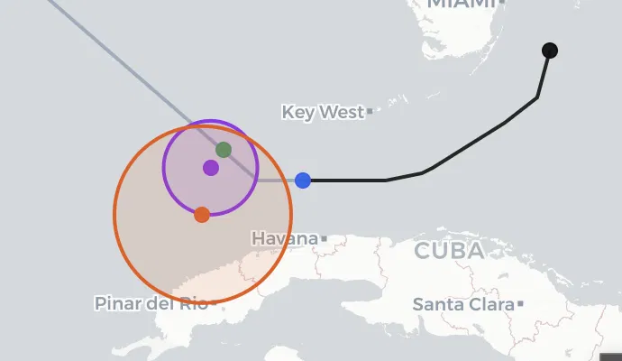
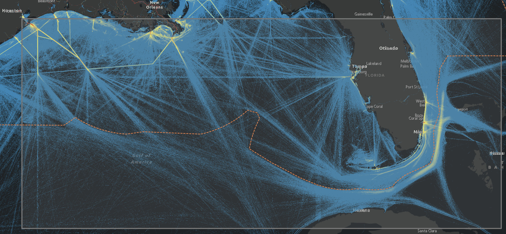
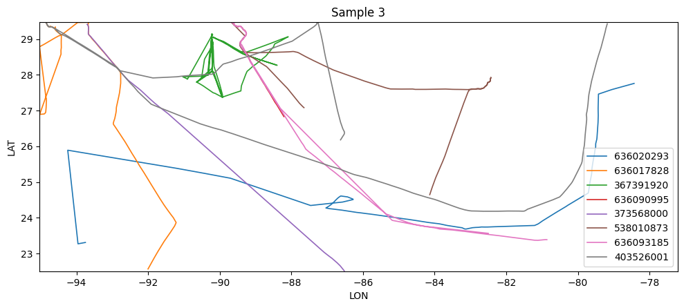
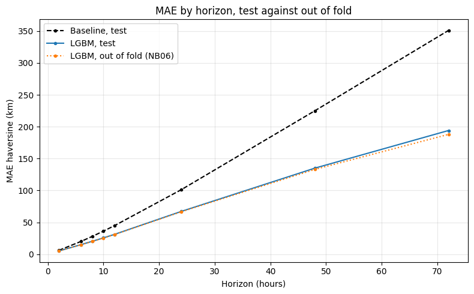
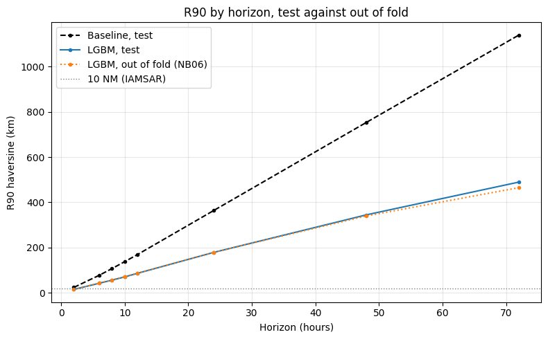
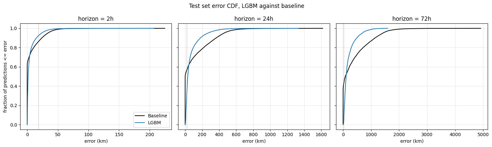
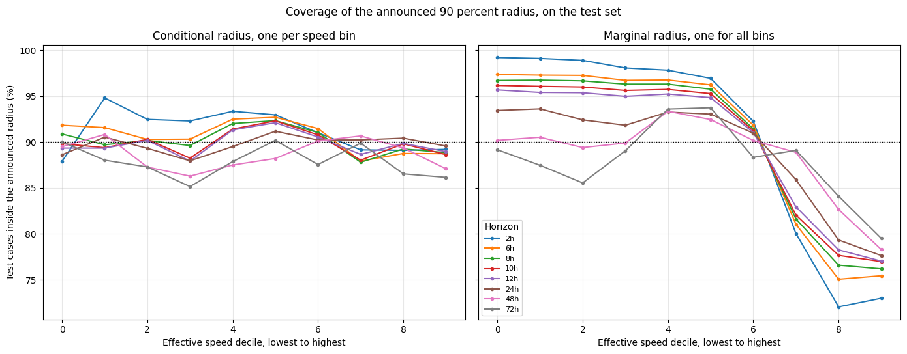

# Vessel trajectory forecasting for maritime search and rescue - Project Summary

**Repo**: [github.com/PabloRougerie/shanty-project](https://github.com/PabloRougerie/shanty-project)

---

## Executive Summary

### Case

Ships broadcast their position through AIS (Automatic Identification System), a radio system most commercial vessels are required to run. When a ship stops sending that signal, the people responsible for it lose track of where it is.

This matters beyond emergencies. A ship that goes silent may simply have a technical problem while still moving normally, so knowing where it likely is stays useful for safety and situational awareness before and during a rescue.

Without a filed route or a known destination, the ship's own recent movement is one of the only usable ways to estimate where it went. A simple "keep going the way you were going" guess is the operational floor for this task: any more complex model has to beat that guess, working from the little information AIS carries while the ship was still transmitting.

### Requirements

The end user is a maritime coordination center. To be useful, the tool has to return a sized, circular search area around the predicted position, rather than an open-ended corridor stretching along every route the ship could have taken. A sized area tells searchers how large a zone to cover and conveys how confident the estimate is: the larger the area, the less certain the forecast.

Beyond that, the tool needs to:
- work for any horizon, from a couple of hours to three days, without being rebuilt for each one,
- rely only on the ship's own signal history (no weather, sea current, or destination data, which are harder to obtain reliably),
- use a fixed amount of that history for every prediction, so the system behaves the same way regardless of the situation.

### Key Outcomes

- One prediction model covers every waiting time from 2 hours to 3 days: no separate model to retrain or maintain per horizon.
- The tool shrinks the search area by **60% at short horizon, growing to 82% at the longest horizon tested** (3 days), which is when the search area is largest and a reduction matters most.
- The tool returns a 90% confidence disk. Checked on data it never trained on, that holds up well overall, though for the fastest-moving ships over the longest horizon the true share is a bit lower than announced (about 86%, not the full 90%).



*One maneuvering vessel, 72h horizon (close-up). Green dot: true position. Purple disk: model search area. Orange disk: baseline search area. Black line: observed past track; grey line: observed future track (unknown at present; shown for context). Illustrative case, not fleet average.*

### Deliverable

A model that predicts a ship's position at the requested waiting time, together with a matching search radius around that point, calibrated so the disk holds the true position about 90% of the time.

### Important insights

- A ship's movement over time falls into a few recognizable patterns: sitting still, sailing in a straight line, or maneuvering (turning, changing speed). The longer the horizon, the more likely the ship has switched between these patterns during the wait, which is what makes long horizons harder to predict.
- For short-horizon forecasts of ships moving in a straight line, a simple guess based on the ship's last known course and speed already works very well.
- The model does not do much better than that simple guess on those easy cases. Its value is on the harder ones: it strongly reduces the size of the worst-case errors, the rare but very large misses that would otherwise force a huge search area.
- From a ship's past movement alone, there is no way to tell whether the simple guess or the model will do better for that specific ship, because that depends on what the ship does next during the wait, which cannot be known in advance. What does help is sizing the search disk from the ship's past speed, which produces a more honest search area.

---

## Repo structure

```
shanty-project/
├── configs/                  # default.yaml: horizons, lookback, split ratios, ingestion bbox, seed
├── src/vessel_tracker/       # installable package: preprocessing, features, baseline,
│                             #   evaluation, calibration, metrics, config, paths
├── scripts/
│   ├── preprocess.py         # ingest -> clean -> resample -> split
│   ├── train.py              # single LGBM + R90 lookups (lgbm + baseline) -> artifacts/
│   └── evaluate_test.py      # held-out test scoring, lgbm vs baseline -> artifacts/
├── notebooks/                # NB01-NB07, the analytical narrative (see below)
├── tests/                    # pytest suite (package + script plumbing)
├── visualizations/           # figures referenced from this document
├── pyproject.toml / uv.lock  # package + pinned dependencies
└── .github/workflows/ci.yml  # ruff + pytest on every push
```

Data (`data/`) and generated artifacts (`artifacts/`) are git-ignored, kept out of the repo for size. The pipeline is fully specified and the package is tested, but a fresh clone cannot rerun it end to end without first downloading the source AIS data.

---

## Notebooks

The seven notebooks (NB01 to NB07) are the analytical core of the project: the full path from raw data to final model, with the reasoning and the trade-offs shown at each step. They cover ingestion and dataset preparation, cleaning and exploration, the choice of baseline, the progression from linear to non-linear models, feature engineering and selection, and the final test evaluation with uncertainty calibration. They are meant to be read in order, as the science behind the packaged result.

The notebooks have already been run; they are written to be read, not re-executed. Re-running them requires downloading the source AIS data first and then takes real time, since it includes model fits and hyperparameter searches. The numbers cited in this document come from these notebooks.

| Notebook | Focus | Outcome |
|---|---|---|
| NB01 | Framing, metrics, ingestion | Scope fixed: AIS-only, cargo/tanker, Gulf of Mexico, November 2024. Builds a single raw dataset from NOAA's per-day files, with a caching layer so already-downloaded days are not re-fetched. |
| NB02 | Cleaning, resampling, split, EDA | Sets the cleaning policy (cause-matched handling of missing and corrupt values), produces a synchronized, cleaned dataset on a fixed time step, and characterizes vessel trajectories into behavior patterns. Vessel-level 70/15/15 split with no shared vessel. |
| NB03 | Deterministic baselines | Constant-velocity extrapolation kept as the baseline. Numerical extrapolations track well at short horizons but their errors grow steeply at long horizons. Lookback fixed at 12h for every horizon and every later model. |
| NB04 | Linear models (Ridge) | A linear model improves overall accuracy over the baseline but collapses on the hardest cases, with a heavier worst-case tail. Neither more history nor stronger regularization closes that gap, which motivates a non-linear model. |
| NB05 | Non-linear models (LGBM) | A single LGBM gives up a little on the low-error tracks but drastically reduces the errors on the high-error tracks, where the search area is set. Lower MAE and lower R90 than both baseline and Ridge at every horizon; retained as the model. |
| NB06 | Feature engineering & selection | Lookback displacement (`dx`, `dy`) carries nearly all the engineered gain; ablation retains lags + `dx`/`dy` + vessel geometry. |
| NB07 | Final test evaluation & calibration | On the held-out test set, LGBM beats the baseline at every horizon, cutting the search area by 60.5% at 2h to 81.5% at 72h. A speed-conditioned confidence radius, built on a held-out split and checked on test, corrects the fleet-wide radius's miscalibration by speed. |

---

## Technical details

### Data

**Dataset.** NOAA AIS position reports for cargo and tanker vessels (type codes 70-89), Gulf of Mexico, November 2024, filtered to that bounding box and vessel type at ingestion. Raw: 7,532,915 position reports, 2,441 vessels.



*Study area. NOAA AIS, Gulf of Mexico, November 2024.*

**Why this dataset.** Public and free, dense enough over one region and one month to support a held-out test split by vessel, and restricted to two vessel types with broadly comparable dynamics (no fishing boats or pleasure craft), which keeps the underlying kinematics reasonably homogeneous.

**Target.** Velocity in degrees per minute (`vx`, `vy`), not absolute position (see Model selection for why).

**Metrics.**
- Haversine MAE (km): ranks models against each other.
- R(p, h): the p-th percentile of the haversine error at horizon h. R(90, 5h) = 5 km means "90% of the prediction errors at a 5h horizon are below 5 km". This is a descriptive statistic about past errors, not automatically a coverage guarantee for a new case; NB07 checks it against held-out data.
- External reference: the IAMSAR 10 nautical mile (18.5 km) default immediate-search radius for drifting vessels. Used only as an order-of-magnitude anchor for what a search radius looks like in practice, not as a target to beat. The comparison that matters throughout is model versus baseline.

**Cleaning.** AIS is a messy real-world feed, and the goal at this stage was to handle missing and corrupt values deliberately rather than apply one blanket rule. The treatment was matched to the cause of each problem:

- **Non-standard missing values.** Several fields encode "missing" with sentinel values rather than a true null, identified from the AIS field conventions. These were converted to proper missing values first, so nothing downstream mistook a placeholder for real data.
- **Interpolation where continuity is physical, imputation where it is not.** Short speed gaps (under 30 minutes) were linearly interpolated, since a vessel's speed is continuous over a short window. Vessel dimensions (Length, Width, Draft), which are static attributes rather than time series, were median-imputed where missing.
- **A custom de-duplication step.** Beyond exact duplicate rows, the data contained a subtler issue: a single MMSI (vessel identifier) sometimes carried two physically distinct tracks, revealed by implausible speed jumps between consecutive pings. A two-pass filter separates an isolated GPS glitch (drop the single bad ping) from a genuine identifier collision (drop the whole vessel when the jumps persist). Treating both as the same kind of error would have corrupted either the tracks or the vessel count.

Net effect: 7,532,915 to 6,167,266 rows, 2,441 to 2,200 vessels.

Resampled to a fixed 10-minute step, then filtered to vessels with enough track to support the horizons used downstream: 3,661,057 rows, 2,173 vessels. **Split by vessel, 70/15/15 (train 1,521 / val 326 / test 326 vessels), so no vessel appears in more than one split.** The test set is untouched until NB07.

### Vessel behavior analysis

Track shapes in the training set fall into three patterns: stationary, straight-line transit, and maneuvering (turning, changing speed). At the case level in the final test evaluation, close to half the population is stationary (47%), 35% straight, 18% maneuvering (NB07 §5).



*Sample train-set tracks illustrating the three patterns: stationary, straight-line, maneuvering (NB02 §8.1).*

Widening the observation window shifts that mix: straightness decreases and the speed distribution changes, so a longer window is more likely to contain a mix of patterns than a single one. Working hypothesis: prediction difficulty comes from the vessel changing pattern during the horizon, not from the length of the window itself.

### Model selection

**Target: velocity, not position.** The model predicts a velocity vector and the future position is reconstructed from it:

```
position(t + h) = position(t) + v * h
```

with `v = (vx, vy)` the predicted velocity in degrees per minute and `h` the horizon in minutes.

Predicting velocity rather than position was chosen because:
- it stays directly comparable with the baseline, which produces the same quantity,
- it behaves cleanly at the boundary: a zero horizon returns the present position with no special case,
- the quantity to predict stays on a similar scale across horizons. A position target would range over very different latitude and longitude values at 2h versus 72h, whereas the velocity a model has to output is far less sensitive to the horizon.

**Baseline: constant-velocity extrapolation.** Assumes the vessel holds its current course and speed. Tested across five lookback windows (1 to 24h) and a horizon grid up to 72h (NB03). A short lookback is marginally better for the baseline itself, but the project fixes 12h for every horizon and every later model, trading a small, bounded loss in baseline accuracy for one shared preprocessing pipeline and more history available to the learned models. A second-order extrapolation that fits the curve of the recent track was also tested and did worse than the straight-line version: the future position is not a simple geometric continuation of the recent track shape, which motivates a learned model.

**Linear model (Ridge).** A Ridge regression on the base features (position lags) modestly improved MAE over the baseline at long horizons (about 13% at 48-72h, slightly negative at 2h) and roughly halved the R90 search area from 12h on. The baseline kept a lower median error, and Ridge's own worst-case error at 72h reached 9,422 km against the baseline's 5,538 km: a heavier extreme tail than the baseline itself. More lags (up to 72) and a longer lookback did not close that gap; the ceiling looked informational, a limit on what a global linear map of the features can express (L2 is a reasonable choice given the correlation between lag features, and regularization strength was not the limiting factor). That ceiling motivated a non-linear model.

**Non-linear model (LightGBM).** A single LGBM regressor has lower MAE than both the baseline and Ridge at every horizon, and the margin over the baseline grows with horizon (about 6% at 2h to about 38% at 72h). On the error tail (R90), LGBM is lowest at every horizon. On the median (R50), the baseline stays lowest through short and medium horizons, since a large share of tracks are stationary or straight, where constant-velocity extrapolation is close to exact by construction. LGBM was retained as the final model.

**Why not a sequential model (LSTM/RNN).** Not tested. Stopping at LGBM was a simplicity call: its gain over the baseline covered the project's need, and a lighter model is preferable once it does.

### Model improvements and test

**Hyperparameter tuning.** A narrowed grid search (probe: 24h horizon, 12h lookback, 6 lags) improved MAE by about 2.4% over untuned LGBM. Not pursued further: the ceiling looked informational, not a tuning problem.

**Feature engineering.** Candidate features: the lookback displacement (`dx`, `dy`) and four local-dynamics features (curvature rate, effective speed, speed trend, recent turn rate). Adding `dx`/`dy` cut MAE by 9 to 23% depending on horizon, several times what tuning gave; the four local-dynamics features contributed nothing measurable and turned slightly negative at long horizons.

**Feature selection: ablation (leave-one-group-out).** The project retrains the model with one feature group removed at a time rather than reading feature importance inside a single fitted model. Importance inside one fit can mislead when features are correlated, since either of two correlated features can look dispensable alone while the pair together carries real signal. The one correlated cluster here is vessel geometry (Length-Width at 0.93, Draft-either at 0.73), removed as one group for that reason.

**Retained feature set:** all position lags, `dx`, `dy`, vessel geometry (Length, Width, Draft), and the horizon `h`. Heading was tested and dropped: it gave a small short-horizon gain that turned slightly negative at 24h and 72h, and the intermediate lags already recover part of the same short-horizon signal.

**Test-set confirmation (NB07).** LGBM has lower MAE and lower R90 than the baseline at every horizon from 2h to 72h. Search area (proportional to R90 squared) drops 60.5% at 2h and 81.5% at 72h, the gain growing with horizon. The out-of-fold to test gap stays under 3.2% on MAE and 5.3% on R90, in the same range as the baseline's own sampling drift between splits, which argues against overfitting rather than proving its absence. This evaluation covers 3,832,949 position-horizon rows across 304 test vessels (of 326 in the split).

| Horizon | Baseline MAE | LGBM MAE | Baseline R90 | LGBM R90 | Search-area reduction |
|--------:|-------------:|---------:|-------------:|---------:|----------------------:|
| 2h  | 6.09   | 5.07   | 23.98   | 15.07  | 60.5% |
| 6h  | 20.14  | 15.08  | 77.67   | 42.31  | 70.3% |
| 8h  | 27.95  | 20.26  | 107.29  | 56.09  | 72.7% |
| 10h | 36.19  | 25.59  | 137.83  | 70.42  | 73.9% |
| 12h | 44.81  | 31.13  | 169.03  | 86.14  | 74.0% |
| 24h | 101.24 | 67.15  | 363.89  | 178.74 | 75.9% |
| 48h | 225.04 | 135.01 | 753.13  | 344.65 | 79.1% |
| 72h | 350.96 | 194.00 | 1139.44 | 489.52 | 81.5% |

_All distances in km, from the NB07 test-set summary (same values as `notebooks/outputs/test_summary_final.csv` when generated locally). Search area scales with R90 squared._



*MAE by horizon, baseline vs LGBM, test vs out-of-fold.*



*R90 by horizon, baseline vs LGBM, test vs out-of-fold. Dotted gray line: IAMSAR 10 NM (18.5 km) reference only, not a model target.*

The improvement is in the error tail, not the median. At 72h, LGBM's worst observed error is 1,595 km, roughly a third of the baseline's 4,914 km, and its 95th percentile (688 km) is below the baseline's 90th (1,139 km).

The baseline keeps a lower median (R50) through most horizons. This is a regime effect. Stationary tracks are 47% of the test cases, and on those tracks the baseline is closer to the truth than LGBM most of the time: 97% of stationary cases at 2h, falling to 71% at 72h.

On maneuvering tracks the picture reverses. LGBM has lower MAE and lower R90 at every horizon, and the gap widens with horizon (MAE at 72h: 604 km baseline against 236 km LGBM). The model gives up little on the easy majority and removes most of the catastrophic misses that set the size of a search area.



*Test-set error distribution at 2h, 24h, 72h, baseline vs LGBM. Lower curve = smaller positioning errors.*

### Prediction confidence

**Per-vessel difficulty is real, persistent, and tied to speed.** How hard a vessel is to predict ranks consistently across horizons: the per-vessel MAE has a Spearman correlation of 0.72 between 2h and 72h. That difficulty tracks speed and maneuvering. The highest-MAE decile of vessels averages 7.6 knots and 27% maneuvering cases; the lowest-MAE decile averages 0.5 knots and is 72% stationary. A vessel's past speed therefore carries real information about how predictable it is.

**That information cannot be turned into a routing rule.** The tempting move is to send easy-looking vessels to the baseline and hard-looking ones to the model. It does not work, for two reasons.

First, the relationship between speed and error has no usable cutoff. It is a smooth, non-monotonic curve, not a clean threshold, and speed's rank correlation with error fades with horizon, from 0.62 at 2h to 0.20 at 72h. There is no point on that curve to split on.

Second, the large errors come from vessels that change behavior during the horizon, and whether a vessel will turn or stop mid-wait is not in its past track. Routing on past movement alone, with no external information such as a destination, cannot separate a vessel that stayed straight from one that looked straight and then turned.

**The same information sizes the confidence radius.** The point prediction stays untouched; only the radius adapts. Replacing one fleet-wide R(90, h) with a speed-conditioned R(90, h, speed) uses effective speed as a stand-in for how predictable a vessel has looked so far, which the past track does carry, and widens or tightens the disk accordingly.

**The fleet-wide radius is miscalibrated by speed.** A single fleet-wide radius is over-confident on fast vessels and over-cautious on slow ones at the same time, at every horizon.

At 2h the spread is 26 points: the announced 90% coverage is really 99% for the slowest vessels and 73% for the fastest. The gap narrows with horizon but does not close. The fastest vessels stay under-covered throughout, at 79.5% at 72h under the fleet-wide radius.

Conditioning on speed brings every group close to the announced 90%. The fastest vessels at 72h move from 79.5% to 86.2%. A residual gap of a few points remains for the fastest vessels at the longest horizons, a known limit rather than one the method fully removes.



*Coverage of the fleet-wide vs speed-conditioned R90 on the test set, by speed decile. Dotted line: announced 90%. Conditioning pulls every group toward the announced 90%.*

---

## Technical annexe

**Model and configuration**
- A single `MultiOutputRegressor(LGBMRegressor)` predicting `(vx, vy)`, with the horizon `h` passed as an input feature so one model serves every horizon.
- Feature set: position lags over a fixed 12h lookback, lookback displacement `dx`/`dy`, and vessel geometry (Length, Width, Draft).
- Hyperparameters, horizons, lookback, lag count, split ratios, and the random seed are defined in `configs/default.yaml`, not hardcoded.

**Splitting and reproducibility**
- 70/15/15 split by vessel (GroupKFold on MMSI): no vessel appears in more than one split, so the test set measures generalization to unseen vessels, not unseen timestamps of known vessels.
- Fixed random seed and identical vessel split replayed across every notebook.
- Intermediate outputs cached with a force-recompute switch, so a notebook can be re-read without rerunning every cell.

**Package and code quality**
- Stable logic lives in an installable `vessel_tracker` package (src layout, editable install via `uv`), separate from the notebooks, which import from the package rather than redefining functions inline so analysis and shippable code do not drift.
- Configuration validated with Pydantic, separating the business parameters (the YAML values) from the config structure and types (`config.py`).
- pytest suite over the package and script plumbing.
- Ruff (lint and format) via pre-commit locally and again in CI; CI runs the full test suite on every push.

**Pipeline**
- `preprocess.py`: ingest, clean, resample, split.
- `train.py`: fit the model and calibrate both R90 lookups, serving artifacts only.
- `evaluate_test.py`: held-out test scoring, model versus baseline.
