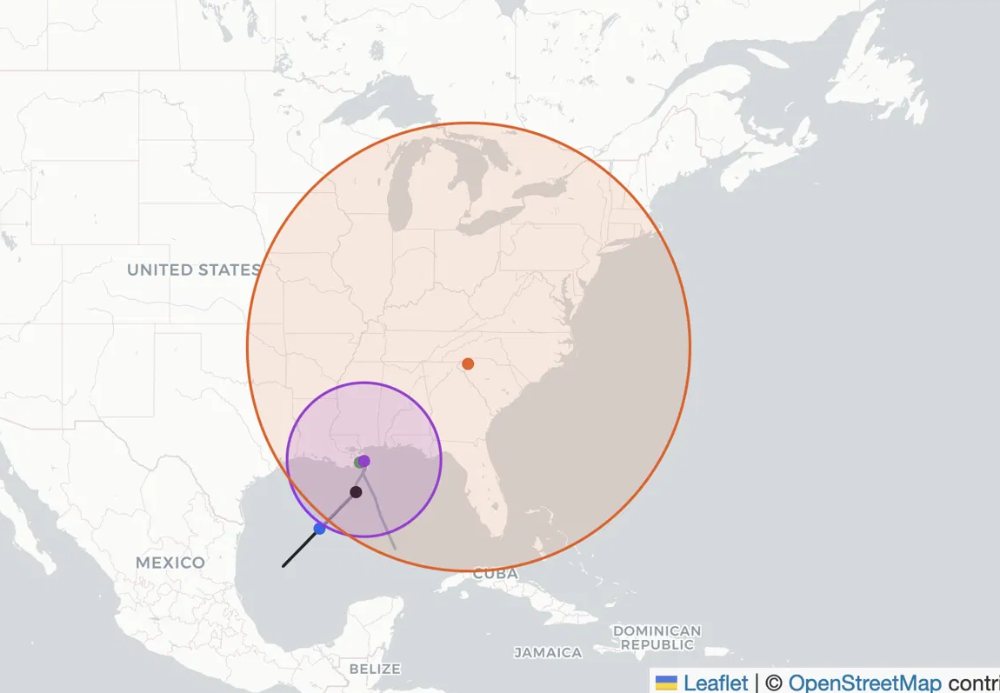

# Maritime vessel position forecasting

Predicts a vessel's future position from its past AIS track and returns a calibrated search disk: predicted point plus an R90 uncertainty radius. Built for maritime safety forecasting and search-and-rescue planning.

On the held-out test set, the model shrinks the potential localization area by about **60% at 2h**, rising to about **82% at 72h**, compared with a constant-velocity baseline (exact values: 60.5% and 81.5%; see [NB07](notebooks/07_final_model_test_evaluation.ipynb)).



*Illustrative case, not fleet-average behavior.* Black line: observed past track (known at present). Grey line: observed future track (unknown at present; shown for context). Black dot: track start. Blue dot: present position (last known AIS ping). Green dot: true position 72h later. Purple dot: model predicted position; purple circle: model R90 search disk. Orange dot: baseline predicted position; orange circle: baseline R90 search disk. The baseline extrapolates a straight course and places a large disk over a wide area. The model keeps a smaller disk near the true position. Aggregate performance is summarized by the reduction percentages above and the error figure below.

## What the package does

The installable package is **`vessel_tracker`**. It trains and serves a single LightGBM model `g(features, h)` that covers any horizon in the trained range (2h to 72h) without retraining per horizon. The model predicts velocity in degrees per minute; future position is reconstructed with haversine geometry. A speed-conditioned R90 radius sizes the search disk around the prediction. The radius is calibrated with split-conformal methods on held-out validation data.

For the full data-science reasoning, trade-offs, and test-set tables, see [PROJECT_SUMMARY.md](PROJECT_SUMMARY.md).


*Held-out test set.* Cumulative distribution of haversine positioning error (km). Lower and left is better. The model curve sits below the baseline at each horizon, with the largest separation in the right tail (large errors).

## Repository structure

```
.
├── README.md
├── PROJECT_SUMMARY.md          # Full DS narrative, metrics, and test-set tables
├── pyproject.toml              # Package metadata and dependencies (uv / pip)
├── uv.lock                     # Locked dependency versions for uv
├── conftest.py                 # Shared pytest fixtures
├── configs/default.yaml        # Horizons, lookback, split ratios, ingestion bbox
├── src/vessel_tracker/         # Installable package
│   ├── preprocessing.py        # NOAA download, cleaning, resampling, split
│   ├── features.py             # Long-format feature table for any horizon
│   ├── baseline.py             # Constant-velocity extrapolation baseline
│   ├── evaluation.py           # Prediction, metrics, position projection
│   ├── calibration.py          # Speed-conditioned R90 lookup tables
│   ├── metrics.py              # Haversine MAE, R90, coverage helpers
│   ├── config.py               # Settings loaded from configs/default.yaml
│   └── paths.py                # Standard data and artifact paths
├── scripts/
│   ├── preprocess.py           # ingest → clean → resample → split
│   ├── train.py                # Fit LGBM + calibrate R90 lookups
│   └── evaluate_test.py        # Held-out test scoring, lgbm vs baseline
├── notebooks/                  # NB01–NB07, method narrative (read in order)
├── tests/                      # pytest suite (package + script plumbing)
├── visualizations/             # Figures for README and PROJECT_SUMMARY
└── .github/workflows/ci.yml    # ruff + pytest on push
```

## Notebooks (NB01–NB07)

The seven notebooks are the method story. Read them in order:

| Notebook | File | Focus |
|----------|------|--------|
| NB01 | `01_framing_ingestion.ipynb` | Problem framing, metrics, NOAA ingestion |
| NB02 | `02_eda.ipynb` | Cleaning, resampling, vessel split, EDA |
| NB03 | `03_deterministic_baselines.ipynb` | Constant-velocity baseline, 12h lookback |
| NB04 | `04_linear_models.ipynb` | Ridge regression vs baseline |
| NB05 | `05_nonlinear_models.ipynb` | LightGBM selection |
| NB06 | `06_FeatEng_FeatSel.ipynb` | Feature engineering and ablation |
| NB07 | `07_final_model_test_evaluation.ipynb` | Test evaluation, calibration, headline numbers |

They are meant to be read as a narrative. They are the source of truth for the reported numbers. Re-running them requires the source AIS data (see below) and can take substantial time.

## Install, tests, and pipeline

**Install** (Python 3.11+):

```bash
uv sync
# or
pip install -e .
```

**Import:**

```python
import vessel_tracker
```

**Tests:**

```bash
uv run pytest
```

**Pipeline order** (reproduces the notebook workflow as scripts):

```bash
uv run python scripts/preprocess.py
uv run python scripts/train.py
uv run python scripts/evaluate_test.py
```

### Reproducibility limits

A fresh clone includes the package, scripts, notebooks, tests, and configs. It does **not** include processed data or trained artifacts: `data/` and `artifacts/` are gitignored.

`scripts/preprocess.py` downloads AIS position reports from NOAA for the Gulf of Mexico (November 2024, cargo and tanker vessels; see `configs/default.yaml`). The download and preprocessing steps are documented and runnable, but they require network access and time. Without that data, you can still read the notebooks, run tests, and inspect the code. End-to-end retraining from a clone alone means fetching the source data first.

## Further reading

[PROJECT_SUMMARY.md](PROJECT_SUMMARY.md) covers the executive summary, data choices, model selection, feature engineering, calibration, and full test-set tables.
